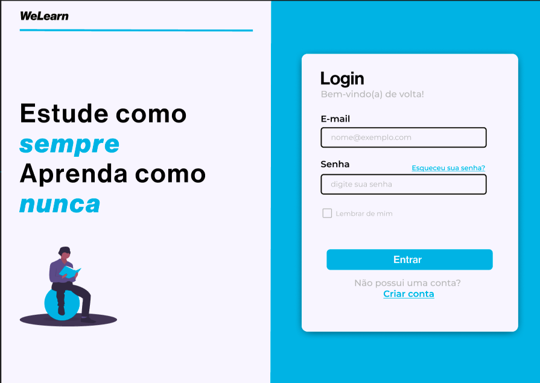

# WeLearn

Bem-vindo ao WeLearn - uma plataforma colaborativa e gamificada de aprendizado desenvolvida por alunos do CEUB (Centro Universitário de Brasília). O WeLearn tem como objetivo revolucionar a experiência de aprendizado, combinando gamificação, análise de dados e motivação para melhorar tanto o engajamento dos alunos quanto os insights dos professores.

## Features

- **Criação de Questionários:** Professores podem criar questionários interativos, incentivando a participação ativa e o pensamento crítico entre os alunos.

- **XP e WeCoins:** Alunos ganham pontos de experiência (XP) e WeCoins para cada questionário que completam. Essas recompensas servem como ferramentas motivacionais e incentivam a participação consistente.

- **Ranking e Competição:** Cada questionário apresenta um ranking com os 5 melhores desempenhos. Isso promove um espírito competitivo saudável entre os alunos, inspirando-os a se destacarem em sua jornada de aprendizado.

- **Dashboards Abrangentes:** A plataforma gera painéis de controle detalhados para os professores, permitindo que analisem o desempenho da turma, identifiquem tendências e adaptem suas estratégias de ensino conforme necessário.

- **Motivação dos Alunos:** Através da abordagem gamificada e do sistema de recompensas, o WeLearn aumenta a motivação e o engajamento dos alunos, criando um ambiente de aprendizado positivo.